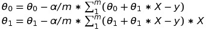

## Linear regression practice

### Overview

One & multi variable linear regression. Datasets are taken from the [coursera machine learning course](http://coursera.org/learn/machine-learning).

#### Datasets

- `housing_prices.in` - `area, number of bedrooms, selling price` 
- `restaurant_profit.in` - `city population, profit made` - Negative means negative profit

#### Single variable linear regression

 

```
def gradient_descent(X, y, nr_iterations):

    m = X.shape[0]
    theta = np.zeros(2)
    for _ in range(nr_iterations):
        theta_zero = theta[0] - alpha/m * sum(theta[0] + theta[1] * X - y)
        theta_one = theta[1] - alpha/m * sum((theta[0] + theta[1] * X  - y) * X)

        theta[0] = theta_zero
        theta[1] = theta_one

    return theta
```


##### Result


#### Multivariable linear regression


```
def gradient_descent(X, y):
    theta = np.zeros((X.shape[1],1))
    m = X.shape[0]
    for _ in range(iterations):
        X_transpose = np.transpose(X)
        cost_deriv = (alpha/m) * np.dot(X_transpose, np.dot(X, theta) - y)
        theta = theta - cost_deriv
    return theta, cost
```

