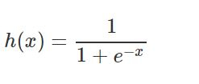
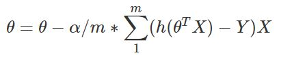

## Logistic regression practice

### Overview

Logistic regression. Datasets are taken from the [coursera machine learning course](http://coursera.org/learn/machine-learning).

#### Datasets

- `student_grades.in` - `two exam results per student` 


#### Sigmoid function



```
def sigmoid(z):
    return 1 / ( 1 + np.exp(-z))
```


#### Gradient descent



```
def gradient_descent(X, y):
    m = X.shape[0]
    theta = np.zeros(X.shape[1])

    for _ in range(iterations):
        scores = np.dot(X, theta)
        hypothesis = sigmoid(scores)

        theta = theta - (alpha/m) * np.dot(np.transpose(X), hypothesis - y)
        cost = -1/m * np.sum(np.dot(y.T, np.log(hypothesis)) + np.dot((1 - y).T, np.log(1 - hypothesis)))
    return theta, cost
```


##### Result

 


#### Multivariable linear regression


```
def gradient_descent(X, y):
    theta = np.zeros((X.shape[1],1))
    m = X.shape[0]
    for _ in range(iterations):
        X_transpose = np.transpose(X)
        cost_deriv = (alpha/m) * np.dot(X_transpose, np.dot(X, theta) - y)
        theta = theta - cost_deriv
    return theta, cost
```

